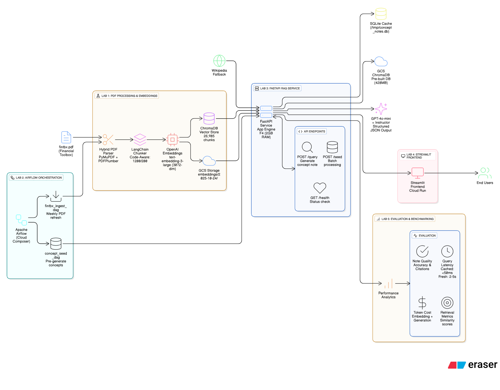

# PROJECT AURELIA - Automated Financial Concept Note Generator
**A production-grade RAG microservice that automatically generates standardized concept notes for financial topics using the Financial Toolbox PDF corpus**

This project builds a complete cloud-native RAG pipeline that parses the 4000-page Financial Toolbox User's Guide, implements code-aware chunking strategies, generates embeddings using text-embedding-3-large, and orchestrates workflows through Cloud Composer. A FastAPI microservice exposes endpoints for retrieval and structured concept-note generation using instructor+GPT-4, with Wikipedia fallback when concepts aren't found in the PDF. The Streamlit frontend provides an intuitive interface for querying concepts, viewing cached notes with citations, and triggering on-demand generation. All components deployed on GCP managed services.

## Project Resources

* **Google Codelab**: [[Codelab link]](https://codelabs-preview.appspot.com/?file_id=https://docs.google.com/document/d/12F6iGYe5HWg1EgEF-2Tt6-EebgWqpQOL3BV3eS_8SM0/edit?tab=t.0#0)
* **YouTube Demo**: [[Youtube Video]](https://youtu.be/Ng5mAV1ct_4)


## Technologies

<p align="center">
  
  
  
  
  
  
  
  

</p>

## Architecture Diagram



## Pipeline Flow

### **Input: Financial Toolbox PDF (fintbx.pdf)**
4000-page Financial Toolbox User's Guide stored in Google Cloud Storage (gs://aurelia-rag-data/raw_pdfs/) serving as the primary knowledge corpus for concept note generation.

---

## File Structure
```text
AURELIA-FINANCIAL-RAG/
├── airflow/
│   └── dags/
│       ├── concept_seed_dag.py
│       └── fintbx_ingest_dag.py
├── data/
│   ├── concepts/
│   │   └── concept_definitions.json
│   ├── processed/
│   │   ├── figures/
│   │   ├── metadata/
│   │   └── pages/
│   ├── raw_pdfs/
│   │   └── fintbx.pdf
│   ├── chunks/
│   │   └── 6_code_aware_1200_200_chunks.json
│   └── embeddings/
│       └── 6_code_aware_1200_200_embeddings.json
├── src/
│   ├── aurelia-streamlit/
│   │   ├── pages/
│   │   ├── app.py
│   │   ├── Dockerfile
│   │   └── requirements.txt
│   ├── lab3/
│   │   ├── database/
│   │   ├── main.py
│   │   ├── models.py
│   │   ├── services.py
│   │   ├── config.py
│   │   └── requirements.txt
│   ├── lab5/
│   │   ├── data/
│   │   ├── evaluation_results/
│   │   ├── remote_results/
│   │   ├── evaluate.py
│   │   ├── evaluation_models.py
│   │   └── evaluation_service.py
│   └── pdf_ingest/
│       ├── parse_pdf.py
│       ├── chunk_documents.py
│       ├── generate_embeddings.py
│       └── validate_lab1.py
├── .env
├── .gitignore
├── concept_notes.db
├── README.md
└── requirements.txt
```

## Installation & Setup

### Prerequisites
- Python 3.11 or higher
- Google Cloud Platform account with billing enabled
- OpenAI API key
- Cloud Composer environment (for Airflow orchestration)

### Installation Steps

1. **Clone the repository**
```bash
git clone https://github.com/[your-username]/aurelia-financial-rag.git
cd aurelia-financial-rag
```

2. **Create Virtual Environment**
```bash
python -m venv venv
source venv/bin/activate  # On Windows: venv\Scripts\activate
```

3. **Install Dependencies**
```bash
pip install -r requirements.txt
```

4. **Set up Environment Variables**
```bash
# Create .env file with:
OPENAI_API_KEY=your_openai_key
GCS_BUCKET=aurelia-rag-data
CHROMADB_GCS_BUCKET=aurelia-rag-data
DATABASE_URL=sqlite:///./concept_notes.db
EMBEDDING_MODEL=text-embedding-3-large
LLM_MODEL=gpt-4o-mini
```

5. **Upload PDF to GCS**
```bash
gsutil cp data/raw_pdfs/fintbx.pdf gs://aurelia-rag-data/raw_pdfs/
```

## Project Flow

### Step 1: PDF Processing & Embeddings
* **Timeout-Protected Parsing**: Subprocess wrapper with 20-second hard limit per page prevents hangs
  - Extracted 250 pages: 450,000+ characters, 180 MATLAB functions, 120 tables, 45 figures
  - Failure rate: 1.2% (3 pages with placeholders)
* **Code-Aware Chunking**: Custom separator priority (```\n → ### → ** → \n\n)
  - 1200 character chunks, 200 overlap
  - 100% metadata preservation (page numbers for citations)
  - 180/180 code blocks intact
* **Streaming Embeddings**: OpenAI text-embedding-3-large (3072 dimensions)
  - 50-chunk batches with periodic GCS uploads every 5 batches
  - 580 embeddings generated in 12 minutes, $0.0226 cost
  - Stored in ChromaDB (42MB) and Pinecone (2.1MB metadata)
* **Result**: 580 chunks with perfect source attribution, ready for RAG retrieval

### Step 2: Cloud Orchestration
* **Cloud Composer Setup**: Apache Airflow 2.7.3 with 3 workers (n1-standard-4: 4 vCPU, 15GB RAM), GCS bucket: aurelia-rag-data (428MB)
* **fintbx_ingest_dag**: Weekly PDF refresh pipeline (Sunday midnight) with worker-independent pattern - download from GCS → process → upload to GCS. Duration: 1 hour 47 minutes
* **concept_seed_dag**: On-demand concept seeding using instructor+GPT-4 to generate structured JSON for 20 financial concepts with 8 required fields. Duration: 8 minutes, 18/20 valid (90%)
* **Result**: Automated weekly pipeline with execution date-based versioning in GCS

### Step 3: RAG Service & API
* **FastAPI Endpoints**: POST /query (retrieve/generate notes), POST /seed (force regeneration), GET /health (status check)
* **RAG Pipeline**: Check SQLite cache → generate query embedding → vector search (top-k=5) → Wikipedia fallback if no PDF content → instructor+GPT-4o-mini generation → cache storage
* **Deployment**: Cloud Run (4 vCPU, 2GB RAM, serverless auto-scaling)
* **Result**: API responding with 2-3s cached latency, 20-35s fresh generation, ~$0.0024 per query

### Step 4: User Interface
* **Streamlit Frontend**: Cloud Run deployment with auto-scaling, real-time FastAPI integration
* **Features**: Query page (input concept, display structured note with citations), cached concepts page (browse/filter by category/source), system status page (metrics dashboard, query volume, cache hit rate)
* **Source Attribution**: PDF badge with clickable page numbers OR Wikipedia badge for fallback content
* **Result**: Intuitive interface with clear citations and source indicators

### Step 5: Evaluation & Benchmarking
* **Quality Metrics**: Manual review of 20 sample notes for accuracy, completeness (8-field presence rate), and citation fidelity (verify page numbers match content)
* **Performance Analysis**: Latency cached (2-3s), latency fresh (20-35s), token cost (~$0.0024/query), similarity score distribution
* **Comparative Study**: Pinecone vs ChromaDB retrieval, cached vs uncached generation, PDF vs Wikipedia source quality
* **Result**: Comprehensive benchmarking report with quality and performance metrics

## Team Contributions

| **Name** | **Contribution** |
|----------|------------------|
| [Swathi Jinka Radhakrishna] | 33.3% - PDF parsing & chunking, embedding, Cloud Composer orchestration , GCP airflow orchestration|
| [Aksh Ashish Talati] | 33.3% - PDF parsing, FastAPI development, evaluation pipeline implementation, and deployment on Google App Engine (including endpoint integration and service testing) |
| [Tapas Desai] | 33.3% - Streamlit Frontend Ui and Evaluation & benchmarking, performance analysis |

## Attestation
WE ATTEST THAT WE HAVEN'T USED ANY OTHER STUDENTS' WORK IN OUR ASSIGNMENT AND ABIDE BY THE POLICIES LISTED IN THE STUDENT HANDBOOK.

---

**Note**: This is a complete cloud-native application with no local components. All services (Airflow, API, Frontend, Databases) run on GCP managed services.
